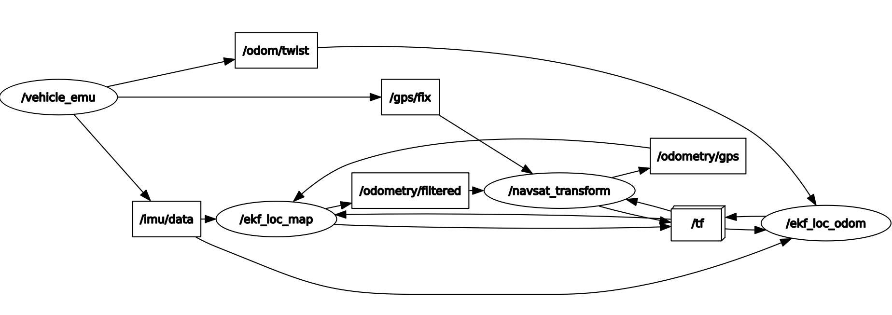
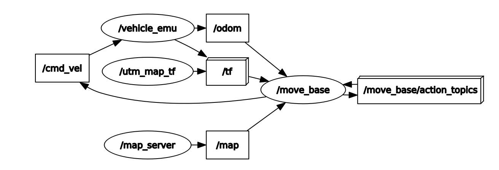
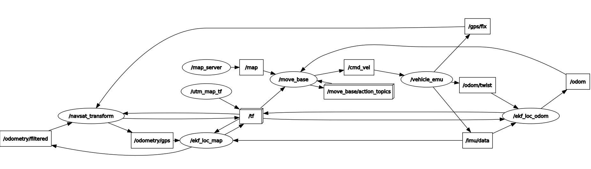

# ROS Navigation and Localisation Study

This repository contains the setup for studying localisation and navigation with a vehicle emulator.


## Components

It uses the [navigation stack](http://wiki.ros.org/navigation) and the [`robot_localization`](http://wiki.ros.org/robot_localization) package. The robot is emulated by a simple vehicle emulator.

### Vehicle Emulator

A simple emulator with GPS, compass and odometry.
It uses simple kinematics to calculate the vehicle's pose based on the velocity commands received at `/cmd_vel`.

#### Subscribed Topics

* `/cmd_vel` ([geometry_msgs/Twist](http://docs.ros.org/api/geometry_msgs/html/msg/Twist.html))
  Receive velocity commands

#### Published Topics

* `/fix` ([sensor_msgs/NavSatFix](http://docs.ros.org/api/sensor_msgs/html/msg/NavSatFix.html))
  GPS position with error.
* `/imu` ([sensor_msgs/Imu](http://docs.ros.org/api/sensor_msgs/html/msg/Imu.html))
  Vehicle orientation only. No angular velocity and acceleration components.
* `/twist` ([geometry_msgs/TwistWithCovarianceStamped](http://docs.ros.org/api/geometry_msgs/html/msg/TwistWithCovarianceStamped.html))
  Linear and angular velocity. The covariance matrix is all zero.
* `/odom` ([nav_msgs/Odometry](http://docs.ros.org/api/nav_msgs/html/msg/Odometry.html))
  Position, orientation, linear and angular velocity.
* `/path` ([nav_msgs/Path](http://docs.ros.org/api/nav_msgs/html/msg/Path.html))
  Path for debugging

#### Parameters

* `~publish_tf`
  Whether to publish transform from `odom` frame to `base_link` frame
* `~publish_odom`
  Wheter to publish `nav_msgs/Odometry` messages
* `~publish_twist`
  Whether to publish `geometry_msgs/TwistWithCovarianceStamped` messages
* `~publish_imu`
  Whether to publish `sensor_msgs/Imu` messages
* `~publish_path`
  Wheter to publish `nav_msgs/Path` messages
* `~publish_fix`
  Whether to publish `sensor_msgs/NavSatFix` messages
* `~gps_err`
  Simulated GPS error: _0_ = no error, _1_ = small error, _2_ = larger error


## Usage

Set ROS environment variables.
```
$ source /opt/ros/melodic/setup.bash
$ source .../ros-study-01/devel/setup.bash
```

Use `rviz` to visualise robot motion and set navigation goals.
```
$ rosrun rviz rviz --display-config ros_study.rviz
```

Use `rqt_reconfigure` to set parameters of the navigation.
```
$ rosrun rqt_reconfigure rqt_reconfigure
```

### Localisation only

```
$ roslaunch ros_study test_loca.launch
```
In this mode only the vehicle emulator and the localisation nodes are enabled.
The configuration is based on [this tutorial](http://docs.ros.org/melodic/api/robot_localization/html/integrating_gps.html).
It can be used to test how the `robot_localization` nodes fuse inaccurate sensor data.

<p align="center">
  
</p>

### Navigation only
```
$ roslaunch ros_study test_navi.launch
```
In this mode only the vehicle emulator and the navigation nodes are enabled.
It can be used to test navigation algorithms assuming that the localisation of the vehicle is perfect.
Navigation goals can be set using `rviz`.

<p align="center">
  
</p>

### Localisation and Navigation
```
$ roslaunch ros_study test_navi_loca.launch
```
In this mode the vehicle emulator and both the navigation and localisation nodes are enables.
This mode emulates the real life scenario when sensor fusion and navigation algorithms have to work together.
Navigation goals can be set using `rviz`.

<p align="center">
  
</p>

---

## UPDATE: Changed Navigation Parameters

### Usage:
To run the Localization and Navigation, simply launch the test_navi_loca.launch
```
$ roslaunch ros_study test_navi_loca.launch
```
This will load the updated navigation parameters.<br>
Also to visualize it in RViz, you can simply launch the below launch file which will preload all the parameters
```
$ roslaunch ros_study rviz.launch
```
### Fine Tuning:
To fine tune the navigation stack, you can open<br>
[dwa_plannar_params.yaml](/config/dwa_plannar_params.yaml) from the config folder<br>
and tune parameters like:
* xy_goal_tolerance (in meters)
* yaw_goal_tolerance (in radian)
etc.