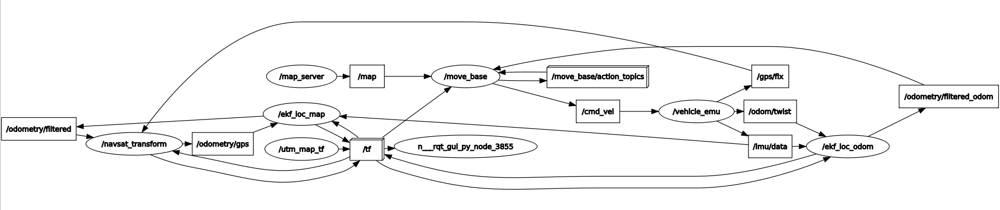

# ROS Navigation and Localisation Study

This repository contains the setup for studying localisation and navigation with a vehicle emulator.


## Components

It uses the [navigation stack](wiki.ros.org/navigation) and the [`robot_localization`](http://wiki.ros.org/robot_localization) package. The robot is emulated by a simple vehicle emulator.

### Vehicle Emulator

A simple emulator with GPS, compass and odometry.

#### Subscribed Topics

* `/cmd_vel` ([geometry_msgs/Twist](http://docs.ros.org/api/geometry_msgs/html/msg/Twist.html))
  Receive velocity commands

#### Published Topics

* `/fix` ([sensor_msgs/NavSatFix](http://docs.ros.org/api/sensor_msgs/html/msg/NavSatFix.html))
  GPS position with error.
* `/imu` ([sensor_msgs/Imu](http://docs.ros.org/api/sensor_msgs/html/msg/Imu.html))
  Vehicle orientation only. No angular velocity and acceleration components.
* `/twist` ([geometry_msgs/TwistWithCovarianceStamped](http://docs.ros.org/api/geometry_msgs/html/msg/TwistWithCovarianceStamped.html))
  Linear and angular velocity. The covariance matrix is all zero.
* `/odom` ([nav_msgs/Odometry](http://docs.ros.org/api/nav_msgs/html/msg/Odometry.html))
  Position, orientation, linear and angular velocity.
* `/path` ([nav_msgs/Path](http://docs.ros.org/api/nav_msgs/html/msg/Path.html))
  Path for debugging

#### Parameters

* `~publish_tf`
  Whether to publish transform from `odom` frame to `base_link` frame
* `~publish_odom`
  Wheter to publish `nav_msgs/Odometry` messages
* `~publish_twist`
  Whether to publish `geometry_msgs/TwistWithCovarianceStamped` messages
* `~publish_imu`
  Whether to publish `sensor_msgs/Imu` messages
* `~publish_path`
  Wheter to publish `nav_msgs/Path` messages
* `~publish_fix`
  Whether to publish `sensor_msgs/NavSatFix` messages
* `~gps_err`
  Simulated GPS error: _0_ = no error, _1_ = small error, _2_ = larger error


## Usage

Set ROS environment variables.
```
$ source /opt/ros/melodic/setup.bash
$ source .../ros-study-01/devel/setup.bash
```

Use `rviz` to visualise robot motion and setting navigation goals.
```
$ rosrun rviz rviz --display-config ros_study.rviz
```

Use `rqt_reconfigure` to set parameters of the navigation.
```
$ rosrun rqt_reconfigure rqt_reconfigure
```

### Localisation only
```
$ roslaunch ros_study test_loca.launch
```

### Navigation only
```
$ roslaunch ros_study test_navi.launch
```

### Localisation and Navigation
```
$ roslaunch ros_study test_navi_loca.launch
```


## Node Graph

<p align="center">
  
</p>
